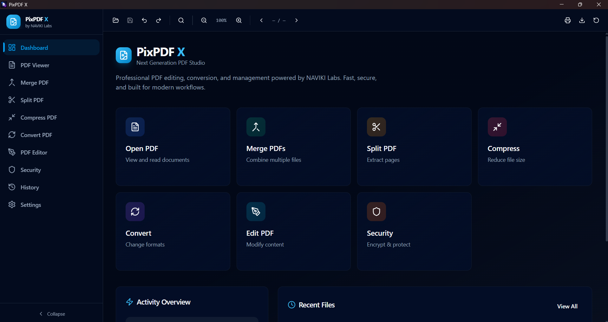

<div align="center">


<h3>
  
</h3>

### *Next Generation PDF Studio — Fast, Native, and Built for Modern Workflows*

[](https://www.rust-lang.org/)
[](https://tauri.app/)
[](https://react.dev/)
[](https://www.typescriptlang.org/)
[](#-license)

**View • Merge • Split • Compress • Convert • Protect**

[Features](#-features) • [Installation](#️-installation) • [Quick Start](#-quick-start) • [Project Structure](#-project-structure) • [Troubleshooting](#-troubleshooting) • [Contributing](#-contributing)

</div>

---

## 🖼️ Screenshots

<div align="center">



<sub>Dashboard — quick actions, activity overview, and recent files</sub>

</div>

---

## 📖 Overview

**PixPDF X** is a professional cross-platform desktop PDF studio built with **Tauri 2** and **React** — combining a native Rust backend with a fast, polished, dark-themed UI. It handles the full lifecycle of a PDF document: viewing, merging, splitting, compressing, converting, editing pages, and encrypting/decrypting — all from a single cohesive app.

Under the hood, PixPDF X leans on best-in-class engines rather than reinventing the wheel: **pdfium** for pixel-perfect page rendering, **Ghostscript** for industry-grade compression, and **qpdf** for robust encryption — wrapped in a type-safe Rust command layer and a modern React front end.

<div align="center">

### 🎯 **Why PixPDF X?**

| **Native Performance** | **Proven Engines** | **Modern UI** | **Full Toolkit** |
|:---:|:---:|:---:|:---:|
| Rust backend, small footprint, no Electron overhead | pdfium · Ghostscript · qpdf under the hood | Dark-themed, animated, built with Radix + Tailwind | Viewer, merge, split, compress, convert, editor, security |

</div>

---

## ✨ Features

### 📄 PDF Viewer

- **High-fidelity rendering** via `pdfium-render`, page by page, with adjustable zoom
- **Thumbnail / single-page modes** and quick page navigation
- **Document info panel** — metadata, size, page count, path

### 🔗 Merge PDF

- Combine **two or more PDFs** into a single document
- **Reorder** files before merging (move up/down)
- Live total page count and combined file size preview

### ✂️ Split PDF

- Define **multiple labeled page ranges** and export each as its own file
- Range validation against the source document's page count
- Batch output to a chosen folder

### 🗜️ Compress PDF

```mermaid
graph LR
    A[Source PDF] --> B{Ghostscript}
    B -->|screen| C[Smallest Size]
    B -->|ebook| D[Balanced]
    B -->|printer| E[High Quality]
    C --> F[Compressed PDF]
    D --> F
    E --> F

    style A fill:#1c2130
    style F fill:#1a3320
```



Compression is delegated entirely to **Ghostscript** — the same engine behind most production-grade PDF compressors — replacing an earlier hand-rolled `lopdf` pass that struggled with scan-heavy, CCITTFax/JBIG2-encoded documents.

- **Three quality presets**: Low (`/screen`), Balanced (`/ebook`), High (`/printer`)
- **Live progress** streamed page-by-page with an estimated time remaining
- **Cancel anytime** — mid-job cancellation cleans up partial output
- Real text layers are **never rasterized**; only embedded images are downsampled

### 🔄 Convert PDF

| Format | Description | Status |
|--------|-------------|:---:|
| **Plain Text (.txt)** | Extracts all text content | ✅ |
| **PDF/A (partial)** | Version bump for archival compatibility | ⚠️ Partial conformance |
| **PNG** | One image per page, rendered via pdfium | ✅ |
| **JPEG** | One image per page, rendered via pdfium | ✅ |

### 🖊️ PDF Editor

- **Page-level operations**: rotate, delete, duplicate, reorder
- **Multi-select** pages with visual selection state
- Tool palette for text and watermark annotation *(in progress)*

### 🔐 Security

- **Encrypt** with a user password and an optional owner password (AES-256 via `qpdf`)
- **Decrypt** password-protected PDFs
- Clear inline guidance if `qpdf` isn't installed or on PATH

### 🏠 Dashboard & History

- **Quick actions** grid linking straight into every tool
- **Activity overview** stats and a **recent files** feed
- Full **History** view of every operation (opened, merged, split, compressed, converted, encrypted, decrypted, edited)

### ⚙️ Settings

- **Theme**: Light / Dark / System
- **Language** selector (English + five more, UI scaffolded)
- File-handling preferences: auto-save, thumbnails, recent-files limit

---

## 🏗️ Architecture

```mermaid
graph TD
    A[React + TypeScript UI] -->|invoke| B[Tauri IPC Bridge]
    B --> C[Rust Command Layer]
    C --> D[lopdf<br/>merge · split · rotate · delete]
    C --> E[pdfium-render<br/>page rendering]
    C --> F[Ghostscript<br/>via shell plugin — compression]
    C --> G[qpdf<br/>via shell plugin — encryption]

    style A fill:#1c2130
    style C fill:#0c4a6e
    style F fill:#331a00
    style G fill:#3d1a1a
```



- **Frontend**: React 18 + TypeScript, Vite, Zustand (persisted store), TanStack Query for async state, Framer Motion for animation, Tailwind CSS + Radix UI primitives for the component system
- **Backend**: Rust on Tauri 2, using `lopdf` for structural PDF edits, `pdfium-render` for rendering, and shelling out to `Ghostscript` / `qpdf` for compression and encryption respectively
- **IPC**: Typed command wrappers in `src/services/pdf.ts` call into `#[tauri::command]` functions, keeping the JS and Rust sides in sync

---

## 🛠️ Installation

### Prerequisites

```
Node.js      >= 18
Rust         >= 1.75 (stable toolchain)
Tauri CLI    v2
```

**External tools required for full functionality:**

| Tool | Used for | Install |
|------|----------|---------|
| **Ghostscript** | PDF compression | Windows: [ghostscript.com](https://ghostscript.com/releases/gsdnld.html) (binary is `gswin64c`) · macOS: `brew install ghostscript` · Linux: `apt install ghostscript` |
| **qpdf** | Encrypt / decrypt | macOS: `brew install qpdf` · Linux: `apt install qpdf` · Windows: [qpdf releases](https://github.com/qpdf/qpdf/releases) |
| **pdfium** | Page rendering | Prebuilt binary from [bblanchon/pdfium-binaries](https://github.com/bblanchon/pdfium-binaries), placed next to the app executable |

> Both Ghostscript and qpdf are invoked through Tauri's permission-gated shell plugin — make sure `shell:allow-execute` and the relevant binary scope are configured in `src-tauri/capabilities/default.json`.

### Setup

```bash
# 1. Clone the repository
git clone https://github.com/NAVIKI-Labs/pixpdf-x.git
cd pixpdf-x

# 2. Install frontend dependencies
npm install

# 3. Run in development mode (opens the Tauri window)
npm run tauri:dev
```

### Production Build

```bash
npm run tauri:build
```

The bundled installer/executable will be output under `src-tauri/target/release/bundle/`.

<details>
<summary><b>Platform Notes</b></summary>

**Windows:**
- Ghostscript's CLI binary is `gswin64c` — ensure its install folder is on PATH
- qpdf's Windows installer typically adds itself to PATH automatically

**macOS:**
- `brew install ghostscript qpdf`
- You may need to allow the app in Security & Privacy settings on first run

**Linux:**
```bash
sudo apt install ghostscript qpdf     # Debian/Ubuntu
sudo dnf install ghostscript qpdf     # Fedora
```

</details>

---

## 🚀 Quick Start

### Open & View a PDF

1. **Launch the app** — `npm run tauri:dev` or run the built binary
2. Go to **PDF Viewer** in the sidebar
3. Click the upload area to **browse for a PDF**
4. Use the toolbar to zoom, navigate pages, or open the info panel

### Merge PDFs

1. Open **Merge PDF**
2. Click **Add PDFs** and select two or more files
3. Reorder with the up/down arrows if needed
4. Set an output filename and click **Merge Documents**

### Compress a PDF

1. Open **Compress PDF** and pick a file
2. Choose a quality preset — **Low**, **Balanced**, or **High**
3. Click **Compress Document** and watch live progress (cancel anytime)
4. Review the size reduction in the stats panel

### Encrypt / Decrypt

1. Open **Security**, select a file
2. Switch between **Encrypt** and **Decrypt** mode
3. Enter a password (and optional owner password for encryption)
4. Click the action button and choose where to save the output

---

## 📂 Project Structure

```
pixpdf-x/
├── src/                          # React frontend
│   ├── components/ui/            # Radix-based UI primitives (button, card, tooltip…)
│   ├── features/                 # Feature screens
│   │   ├── dashboard/            # Dashboard.tsx
│   │   ├── pdf-viewer/           # PDFViewer.tsx
│   │   ├── merge/                # MergePDF.tsx
│   │   ├── split/                # SplitPDF.tsx
│   │   ├── compress/             # CompressPDF.tsx
│   │   ├── converter/            # ConvertPDF.tsx
│   │   ├── editor/               # PDFEditor.tsx
│   │   ├── security/             # Security.tsx
│   │   ├── history/              # History.tsx
│   │   └── settings/             # Settings.tsx
│   ├── layouts/                  # MainLayout, Sidebar, TopToolbar
│   ├── hooks/                    # usePDF.ts (TanStack Query hooks)
│   ├── services/                 # pdf.ts (typed Tauri invoke wrappers)
│   ├── stores/                   # appStore.ts (Zustand, persisted)
│   ├── types/                    # Shared TypeScript interfaces
│   └── utils/                    # cn(), formatFileSize(), formatDate()…
│
├── src-tauri/                    # Rust backend
│   ├── src/
│   │   ├── main.rs               # App entry, command registration
│   │   ├── commands/
│   │   │   ├── pdf.rs            # open, metadata, pages, merge, split, rotate, delete
│   │   │   ├── converters.rs     # compress_pdf (Ghostscript), convert_pdf
│   │   │   └── security.rs       # encrypt_pdf / decrypt_pdf (qpdf)
│   │   ├── render.rs             # pdfium page rendering (single + parallel batch)
│   │   ├── filesystem.rs         # native file/folder pickers, file info
│   │   ├── workers/               # background task queue
│   │   └── utils/errors.rs       # PDFError type
│   ├── build.rs
│   └── Cargo.toml
│
├── index.html
├── package.json
├── vite.config.ts
├── tailwind.config.js
└── tsconfig.json
```

### Architecture Notes

**`src-tauri/src/commands/pdf.rs`**
- `open_pdf`, `get_pdf_metadata`, `get_pdf_pages` — document introspection via `lopdf`
- `merge_pdfs` — low-level object-graph merge (catalog/pages tree splicing)
- `split_pdf` — page-range extraction into separate files
- `rotate_pages`, `delete_pages` — in-place page dictionary edits

**`src-tauri/src/commands/converters.rs`**
- `compress_pdf` — spawns Ghostscript as a child process, streams stdout for per-page progress events, supports cancellation via an `AtomicBool` flag
- `convert_pdf` — text extraction, PDF/A version bump, or page rasterization to PNG/JPEG

**`src-tauri/src/commands/security.rs`**
- `encrypt_pdf` / `decrypt_pdf` — shell out to `qpdf` for AES-256 encryption and password removal

**`src-tauri/src/render.rs`**
- Thread-local `pdfium` binding, single-page and parallelized (`rayon`) multi-page rendering to PNG/JPEG

---

## 🐛 Troubleshooting

<details>
<summary><b>"Failed to start Ghostscript"</b></summary>

Ghostscript isn't installed or isn't on PATH. Install it for your OS (see [Installation](#️-installation)) and restart the app. On Windows, the binary name is `gswin64c`.

</details>

<details>
<summary><b>"Failed to start qpdf" / encryption unavailable</b></summary>

Install `qpdf` and ensure it's on PATH, then restart the app. Also confirm the shell plugin's execute permission is scoped to `qpdf` in `src-tauri/capabilities/default.json`.

</details>

<details>
<summary><b>"Could not load the pdfium library"</b></summary>

Download a prebuilt `pdfium` binary for your OS from [bblanchon/pdfium-binaries](https://github.com/bblanchon/pdfium-binaries) and place it next to the application executable.

</details>

<details>
<summary><b>Compression hangs or fails on scanned PDFs</b></summary>

This was the limitation of the earlier `lopdf`-based compressor with CCITTFax/JBIG2-encoded pages. Compression is now fully delegated to Ghostscript, which handles these correctly — make sure you're on the current version.

</details>

<details>
<summary><b>Incorrect password on decrypt</b></summary>

`qpdf` reports this explicitly — double-check the password. Lost passwords cannot be recovered.

</details>

---

## 🤝 Contributing

Contributions are welcome! Here's how to get started:

```bash
# 1. Fork the repository on GitHub

# 2. Clone your fork
git clone https://github.com/YOUR_USERNAME/pixpdf-x.git

# 3. Create a feature branch
git checkout -b feature/your-feature-name

# 4. Make your changes and commit
git commit -m "Add: description of your change"

# 5. Push and open a Pull Request
git push origin feature/your-feature-name
```

### Areas to Contribute

| Area | Ideas |
|------|-------|
| 🖊️ **Editor** | Text insertion, watermarking, annotation persistence |
| 🔄 **Convert** | Full PDF/A conformance, DOCX/HTML export |
| 🗜️ **Compression** | Custom target-size mode |
| 🎨 **UI** | Drag-and-drop file support, additional themes |
| 🌐 **i18n** | Complete translations for the language selector |
| 🧪 **Tests** | Unit tests for Rust command layer and React hooks |

---

## 📄 License

This project is licensed under a **Proprietary License** — see the `Cargo.toml` for details. All rights reserved by NAVIKI Labs.

---

## 🙏 Acknowledgments

<div align="center">

### Built by NAVIKI Labs

[](https://tauri.app/)
[](https://pdfium.googlesource.com/pdfium/)
[](https://www.ghostscript.com/)
[](https://qpdf.sourceforge.io/)

### Special Thanks To

**pdfium / Chromium Team** | **Artifex (Ghostscript)** | **qpdf Maintainers** | **Tauri Community**
:---: | :---: | :---: | :---:
Rendering engine that powers the viewer | Battle-tested compression backend | Reliable, fast PDF encryption | Making native cross-platform apps a joy to build

</div>

---

<div align="center">


### ✨ **Built with ❤️ by NAVIKI Labs** ✨

[](https://github.com/7Na7iD7)
[](https://github.com/nikifarzami)

</div>
